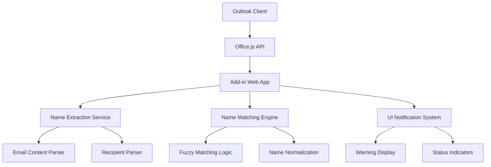

# Design Document

## Overview

The Outlook Name Validator extension will be built as an Office Add-in using the Office JavaScript API (Office.js) targeting Outlook version 1.2025.x and newer. The extension will monitor email composition events, parse email content and recipients, perform name matching logic, and provide user feedback through the Outlook interface.

The solution will consist of a web-based add-in that integrates with Outlook's compose mode, utilizing event-driven architecture to validate recipient names in real-time as users compose emails.

## Architecture

### High-Level Architecture



### Component Architecture

The extension will follow a modular architecture with the following layers:

1. **Presentation Layer**: UI components for warnings and status indicators
2. **Business Logic Layer**: Name extraction, matching, and validation logic
3. **Integration Layer**: Office.js API integration and event handling
4. **Utility Layer**: Text parsing, normalization, and helper functions

## Components and Interfaces

### 1. Add-in Manifest and Configuration

**Purpose**: Defines the add-in metadata, permissions, and integration points with Outlook.

**Key Elements**:
- Manifest file (manifest.xml) specifying Outlook integration
- Compose mode activation rules
- Required permissions for reading email content and recipients
- UI extension points for notifications

### 2. Email Content Parser

**Purpose**: Extracts and analyzes email content to identify greetings and names.

**Interface**:
```typescript
interface EmailContentParser {
  extractGreetings(emailBody: string): GreetingMatch[];
  parseEmailContent(content: string): ParsedContent;
}

interface GreetingMatch {
  fullMatch: string;
  extractedName: string;
  position: number;
  confidence: number;
}

interface ParsedContent {
  greetings: GreetingMatch[];
  hasValidContent: boolean;
}
```

**Key Features**:
- Regular expression patterns for common greeting formats
- Name extraction from various greeting styles
- Confidence scoring for extracted names
- Support for multiple greetings in one email

### 3. Recipient Parser

**Purpose**: Extracts and normalizes names from email addresses in To, CC, and BCC fields.

**Interface**:
```typescript
interface RecipientParser {
  parseEmailAddress(email: string): ParsedRecipient;
  extractAllRecipients(recipients: Office.EmailAddressDetails[]): ParsedRecipient[];
}

interface ParsedRecipient {
  email: string;
  displayName?: string;
  extractedNames: string[];
  isGeneric: boolean;
}
```

**Key Features**:
- Email address parsing for common formats (firstname.lastname, firstnamelastname, etc.)
- Display name extraction when available
- Generic email detection (info@, support@, etc.)
- Name component separation and normalization

### 4. Name Matching Engine

**Purpose**: Compares extracted greeting names with recipient names and determines matches.

**Interface**:
```typescript
interface NameMatchingEngine {
  validateNames(greetings: GreetingMatch[], recipients: ParsedRecipient[]): ValidationResult[];
  findBestMatch(greetingName: string, recipients: ParsedRecipient[]): MatchResult;
}

interface ValidationResult {
  greetingName: string;
  isValid: boolean;
  suggestedRecipient?: ParsedRecipient;
  confidence: number;
}

interface MatchResult {
  recipient: ParsedRecipient;
  matchType: 'exact' | 'partial' | 'fuzzy' | 'none';
  confidence: number;
}
```

**Key Features**:
- Exact matching (case-insensitive)
- Partial matching for first/last names
- Fuzzy matching for common misspellings
- Confidence scoring for match quality

### 5. UI Notification System

**Purpose**: Displays validation results and warnings to users through Outlook's interface.

**Interface**:
```typescript
interface NotificationSystem {
  showWarning(validation: ValidationResult): void;
  showSuccess(): void;
  clearNotifications(): void;
  updateStatus(status: ValidationStatus): void;
}

interface ValidationStatus {
  isValidating: boolean;
  hasWarnings: boolean;
  warningCount: number;
}
```

**Key Features**:
- Non-intrusive warning notifications
- Suggested corrections
- Dismissible warnings
- Status indicators

### 6. Event Handler and Orchestrator

**Purpose**: Coordinates the validation process and manages Outlook integration.

**Interface**:
```typescript
interface ValidationOrchestrator {
  initialize(): Promise<void>;
  validateCurrentEmail(): Promise<ValidationResult[]>;
  onRecipientsChanged(): void;
  onContentChanged(): void;
}
```

## Data Models

### Core Data Structures

```typescript
// Configuration and settings
interface ValidationConfig {
  enabledGreetingPatterns: string[];
  minimumConfidenceThreshold: number;
  enableFuzzyMatching: boolean;
  excludeGenericEmails: boolean;
}

// Validation state
interface ValidationState {
  currentValidation?: ValidationResult[];
  lastValidationTime: Date;
  isEnabled: boolean;
}

// User preferences
interface UserPreferences {
  showSuccessNotifications: boolean;
  autoCorrectSuggestions: boolean;
  warningDisplayDuration: number;
}
```

## Error Handling

### Error Categories and Handling Strategy

1. **Office.js API Errors**
   - Network connectivity issues
   - Permission denied errors
   - API version compatibility issues
   - Graceful degradation with user notification

2. **Content Parsing Errors**
   - Invalid email content format
   - Encoding issues
   - Large content handling
   - Fallback to basic validation

3. **Validation Logic Errors**
   - Unexpected data formats
   - Performance timeouts
   - Memory constraints
   - Error logging and recovery

### Error Recovery Mechanisms

- Retry logic for transient failures
- Fallback validation modes
- User notification for critical errors
- Diagnostic logging for troubleshooting

## Testing Strategy

### Unit Testing

- **Name Extraction Logic**: Test various greeting patterns and edge cases
- **Email Parsing**: Test different email address formats and structures
- **Matching Algorithm**: Test exact, partial, and fuzzy matching scenarios
- **Normalization Functions**: Test case handling and special characters

### Integration Testing

- **Office.js Integration**: Test add-in loading and API interactions
- **Event Handling**: Test recipient and content change events
- **UI Components**: Test notification display and user interactions
- **End-to-End Workflows**: Test complete validation scenarios

### Test Data Sets

- Common email greeting patterns
- Various email address formats
- Edge cases (special characters, multiple names, etc.)
- Different Outlook client configurations
- Performance test scenarios with large recipient lists

### Testing Environment

- Outlook desktop client (version 1.2025.x+)
- Outlook web client
- Different email account types (Exchange, IMAP, etc.)
- Various screen sizes and accessibility configurations

## Performance Considerations

### Optimization Strategies

- **Lazy Loading**: Load validation logic only when needed
- **Debounced Validation**: Avoid excessive validation during rapid typing
- **Caching**: Cache parsed recipient data to avoid re-processing
- **Asynchronous Processing**: Use web workers for intensive parsing operations

### Resource Management

- Memory usage monitoring for large emails
- CPU usage optimization for real-time validation
- Network request minimization
- Battery usage considerations for mobile devices

## Security and Privacy

### Data Handling

- No email content stored permanently
- Local processing only (no external API calls)
- Minimal data retention
- User consent for data processing

### Security Measures

- Input sanitization for email content
- XSS prevention in UI components
- Secure communication with Office.js APIs
- Regular security updates and patches